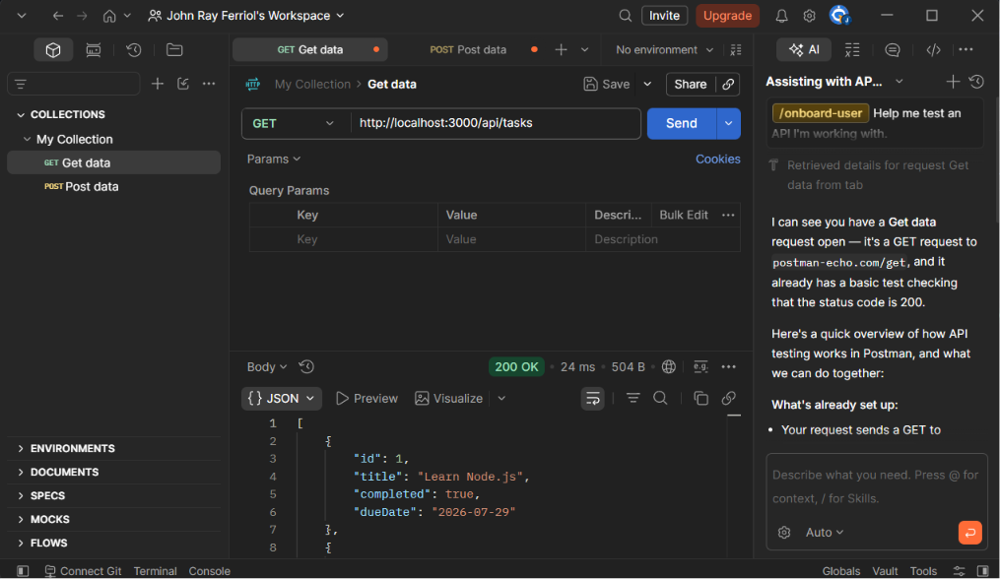
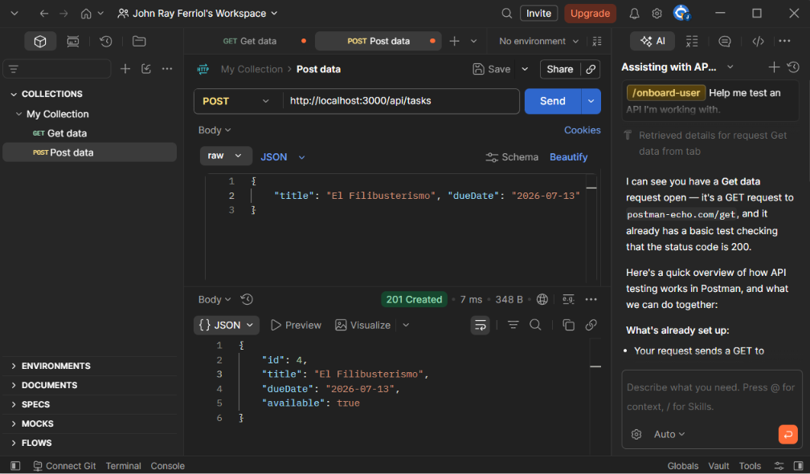
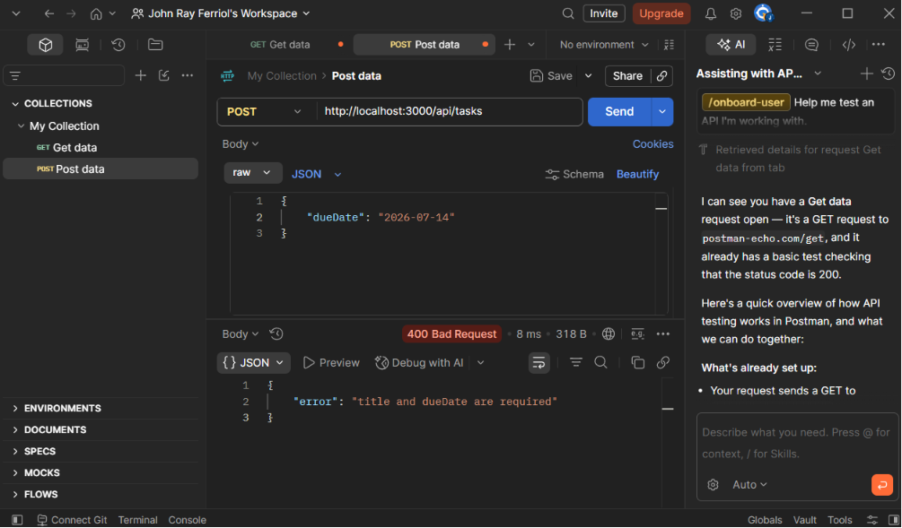
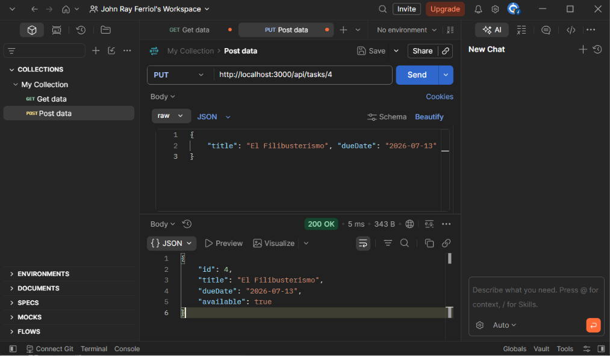
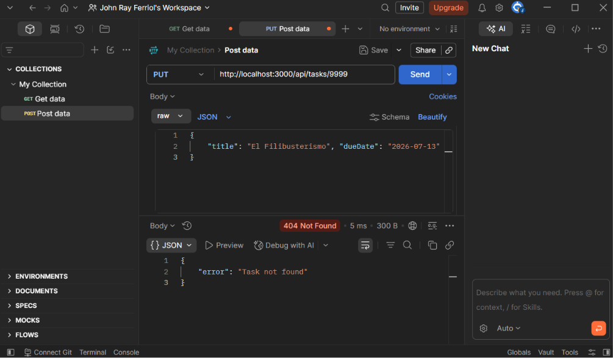
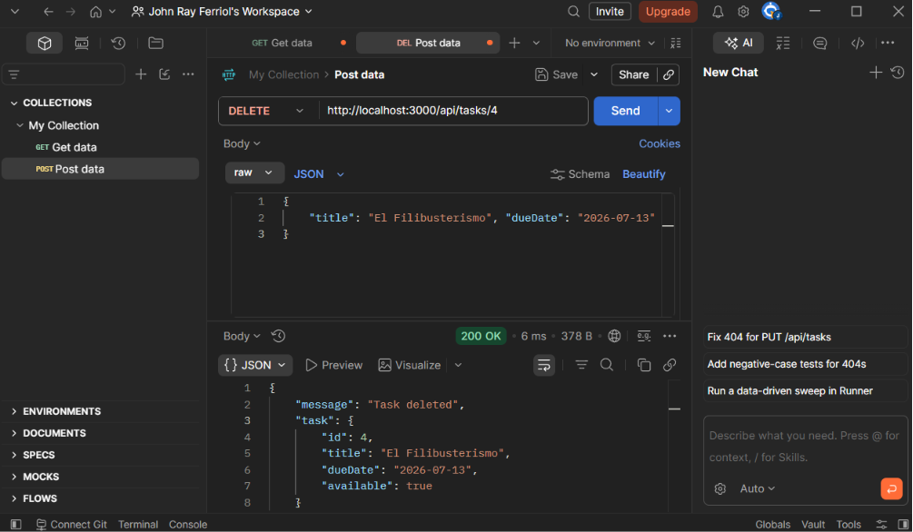
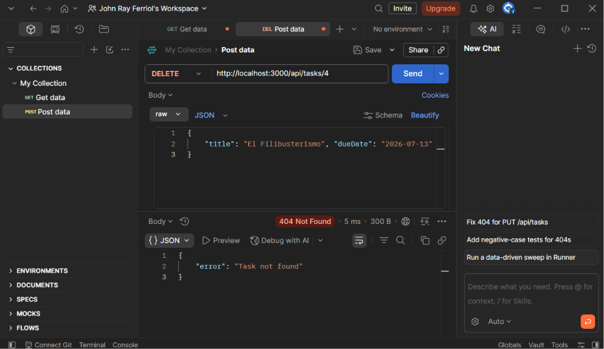

# itelect2-project
My IT Elective 2 backend web development project.

Hi, I am John Ray A. Ferriol a 3rd-year BSIT student in De La Salle Lipa.

## API TESTING ##

#### 1. Get Tasks

#### 2. Post Tasks

400 error
#### 3. Put Tasks

404 error
#### 4. Delete Tasks

404 error